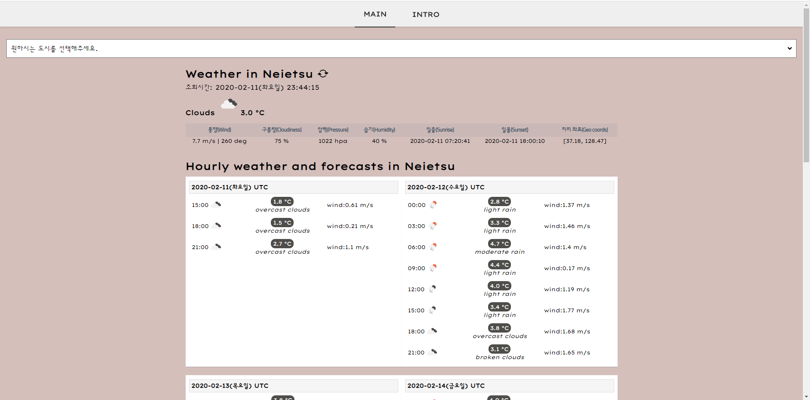

# vue-weather-v2

- vue-weather 앱

```
vue-cli : 3.8.3
프로젝트 구성
- babel / linter, formatter (수동 기본 구성)

scss 구성
npm i --save-dev node-sass sass-loader

vue router / vuex 구성
npm i --save vue-router vuex

vue ui
runtimeCompiler: true 설정

CSS 그라데이션 참조 사이트
- https://webgradients.com/

- weather api
https://openweathermap.org/api

```

- heroku deploy

```

npm install express serve-static --save

server.js 파일 생성

package.json npm 스크립트 추가
"start": "node server.js" 

test : http://localhost:8080/

create heroku app
https://www.heroku.com/

app name : zero86
https://<YOUR-PROJECT-NAME>.herokuapp.com
deployed to Heroku
https://zero86.herokuapp.com/ 

- heroku cli
npm install -g heroku
heroku --version
heroku login
heroku logs -a

```

### 구조 및 규약

```
/src
  /assets : icon, image, scss 자원
  /components
    /component : 특정 기능을 하는 컴포넌트
    /pages : page 를 구성하는 컴포넌트 
  /mixins : 믹스인
  /plugins : 플러그인
  /routes : 라우터
  /store : 스토어(상태관리)

- 컴포넌트(*.vue)명은 대문자로 시작
- 글로벌 CSS 작성 -> /src/assets/scss/app.scss
- 변수명은 소문자로 시작(camelCase)
- 컴포넌트 props kebap-case 사용
- 컴포넌트에서 API 조회시, 메서드명
  조회 : find**
  생성 : create**
  수정 : update**
  삭제 : delete**

```

### 프로젝트 실행 결과




## Project setup
```
npm install
```

### Compiles and hot-reloads for development
```
npm run serve
```

### Compiles and minifies for production
```
npm run build
```

### Run your tests
```
npm run test
```

### Lints and fixes files
```
npm run lint
```

### Customize configuration
See [Configuration Reference](https://cli.vuejs.org/config/).
